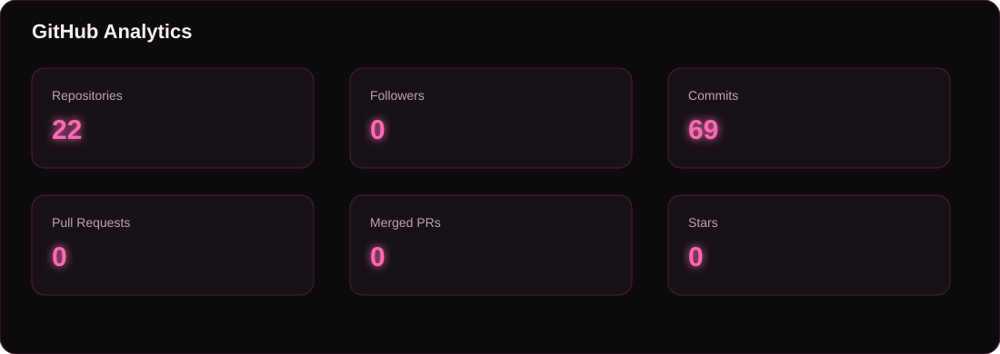
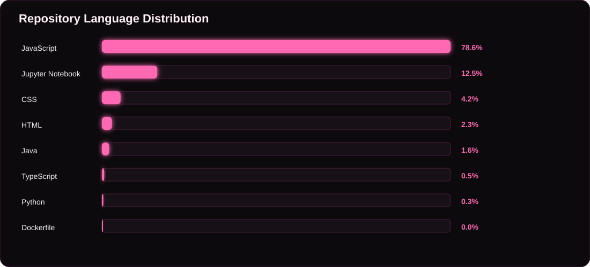
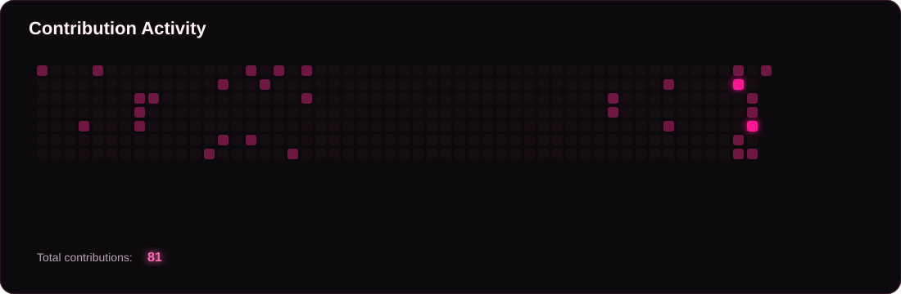
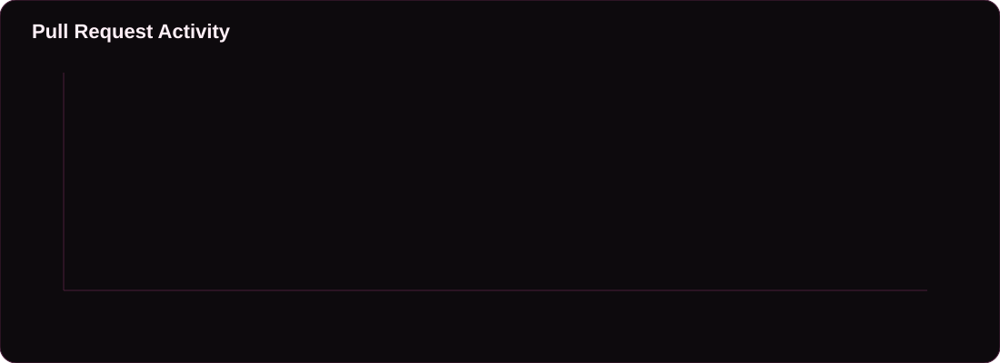

<div align="center">


<br/>

[](https://portfolioshreyagupta.netlify.app/)
[](https://www.linkedin.com/in/shreya-gupta-210426261/)
[](https://github.com/Shreya11G)
[](https://leetcode.com/u/Shreya525/)
[](https://www.geeksforgeeks.org/profile/geeks__sy?tab=activity)

</div>

---

## 👩🏻‍💻 About Me

```text
💻 Software Engineer focused on building scalable and practical applications
☕ Java developer exploring backend engineering and system design
🌸 Building projects with React, TypeScript, Node.js and Express
☁️ Working with AWS, REST APIs and cloud-based applications
🧩 Solved 800+ DSA problems across LeetCode and GeeksForGeeks
🚀 Former Software Engineering Intern at Globalization Partners (G-P)
🏆 Top 100 Team — Myntra WeForShe Hackathon 2025
```


<div align="center">

### `Tech-Stack`

### Languages


### Frontend


### Backend


### Databases


### Cloud & DevOps


### Tools


</div>

<p align="center">


</p>


---

<!--START_MERGED_PRS-->
<div align="center">

**🔀 0 Total PRs**
&nbsp;&nbsp; • &nbsp;&nbsp;
**🩷 0 Merged PRs**

</div>
<!--END_MERGED_PRS-->

---

<div align="center">



</div>

---

<div align="center">



</div>

---

<div align="center">



</div>

---

<div align="center">



</div>

---

<div align="center">


</div>


---

## 🌸 Let's Connect

<div align="center">

[](https://portfolioshreyagupta.netlify.app/)
[](https://www.linkedin.com/in/shreya-gupta-210426261/)
[](https://github.com/Shreya11G)
[](https://leetcode.com/u/Shreya525/)
[](https://www.geeksforgeeks.org/profile/geeks\_\_sy?tab=activity)

<br/><br/>

### 💗 "Building one commit at a time."

</div>
