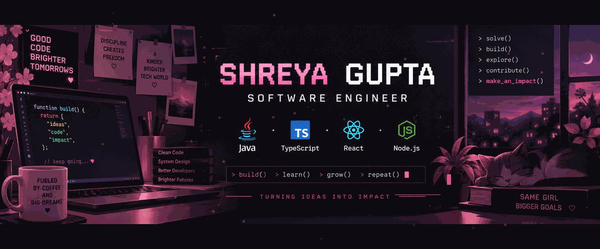

<div align="center">
<div align="center">



</div>

<br/>
# 🌸 Hi, I'm Shreya Gupta 👋

### 💻 Software Engineer | Java | TypeScript | React | Node.js


<br/>


</div>

---

## 👩🏻‍💻 About Me

```text
💻 Software Engineer passionate about building scalable applications
☕ Java developer exploring backend engineering and system design
🌸 Building full-stack projects with React, Node.js and Express
☁️ Working with AWS, REST APIs and cloud-based applications
🧩 Solved 800+ DSA problems
🚀 Former Software Engineering Intern at Globalization Partners (G-P)
🏆 Top 100 Team — Myntra WeForShe Hackathon 2025
```

---

## 🛠️ Tech Stack

<div align="center">

### 💻 Languages


### 🎨 Frontend


### ⚙️ Backend


### 🗄️ Databases


### ☁️ Cloud & DevOps


### 🔧 Tools


</div>

---

## 🚀 Featured Projects

### 🌸 VidyaSaathi

**AI-Powered Learning & Career Companion**

* 🤖 AI tutoring and personalized study planning
* 🎯 Career guidance and productivity tools
* 🔗 REST APIs with Node.js and Express
* 🗄️ MongoDB database
* 🔐 JWT authentication
* ✨ Gemini API integration

🔗 **[View Repository]([https://github.com/Shreya11G](https://github.com/Shreya11G/Vidya_Saathi_App
))**

---

### 🤖 PrepPilot AI

**SDE Preparation & Career Intelligence Platform**

A platform designed to help developers prepare for software engineering roles through personalized preparation, DSA tracking, and career intelligence.

* 📚 Personalized SDE preparation
* 🧩 DSA practice and progress tracking
* 💼 Career intelligence
* 🤖 AI-powered assistance

🔗 **[View Repository]([https://github.com/Shreya11G](https://github.com/Shreya11G/PrepPilot_AI
))**

---

### 🔐 Authentication System

**Secure JWT + OTP Authentication**

* 🔑 JWT authentication
* 📧 Email OTP verification
* 🔄 Password recovery
* 🛡️ Session management
* ⚛️ React frontend
* 🟢 Node.js + Express backend
* 🍃 MongoDB database

🔗 **[View Repository]([https://github.com/Shreya11G](https://github.com/Shreya11G/Authentication_App))**

---

### 💬 GigglyTalk

**Real-Time Chat Application**

A real-time communication application built with React and Socket.io.

* ⚛️ React
* 💬 Socket.io
* 🔄 Real-time communication
* 🎨 Responsive interface

🔗 **[View Repository]([https://github.com/Shreya11G](https://github.com/Shreya11G/GigglyTalk))**

---

## 🧩 DSA Journey

<div align="center">

### 🚀 800+ Problems Solved

**LeetCode • GeeksForGeeks**

</div>

---

## 📊 GitHub Analytics

<div align="center">


</div>

---

## 🔥 Contribution Streak

<div align="center">


</div>

---

## 🏆 Achievements

* 🏅 **Top 100 Teams** — Myntra WeForShe Hackathon 2025
* 🧩 **800+ DSA Problems Solved**
* 🥈 **2nd Place** — Science & Technology Exhibition
* 🏐 **Organized Intra-NIT Sports Meet 2025**

---

## 🐍 Contribution Snake

<div align="center">


</div>

---

# 🌸 Let's Connect

<div align="center">

<a href="https://www.linkedin.com/in/shreya-gupta-210426261/">
  
</a>

<a href="https://github.com/Shreya11G">
  
</a>

<a href="https://leetcode.com/u/Shreya525/">
  
</a>

<a href="https://www.geeksforgeeks.org/profile/geeks__sy?tab=activity">
  
</a>

<a href="https://portfolioshreyagupta.netlify.app/">
  
</a>

</div>

<br/>

<div align="center">

### 💗 "Building one commit at a time."

</div>
